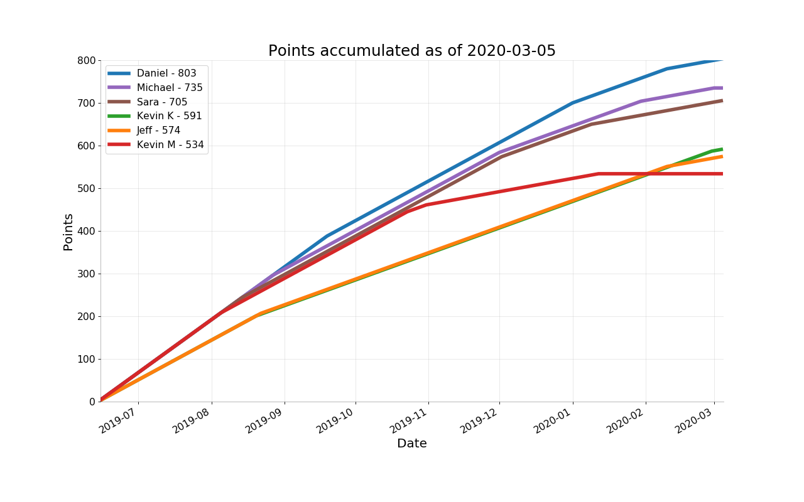
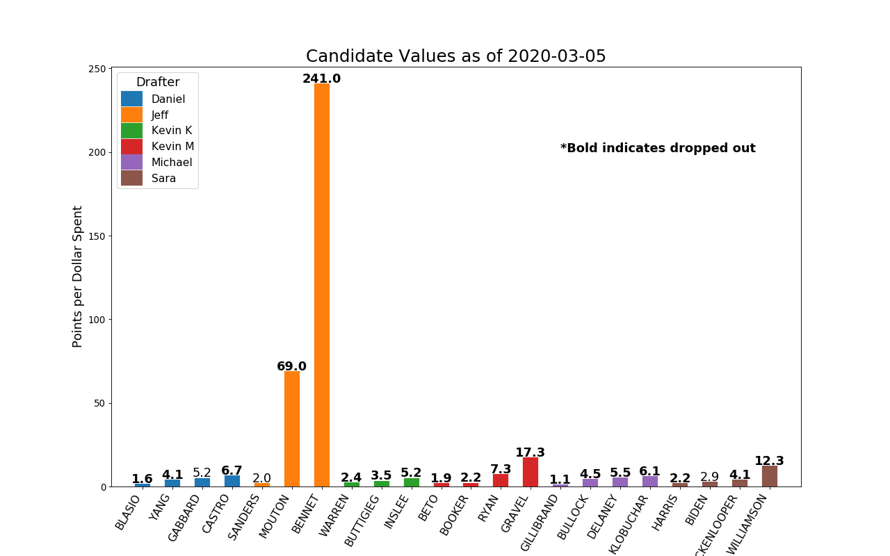
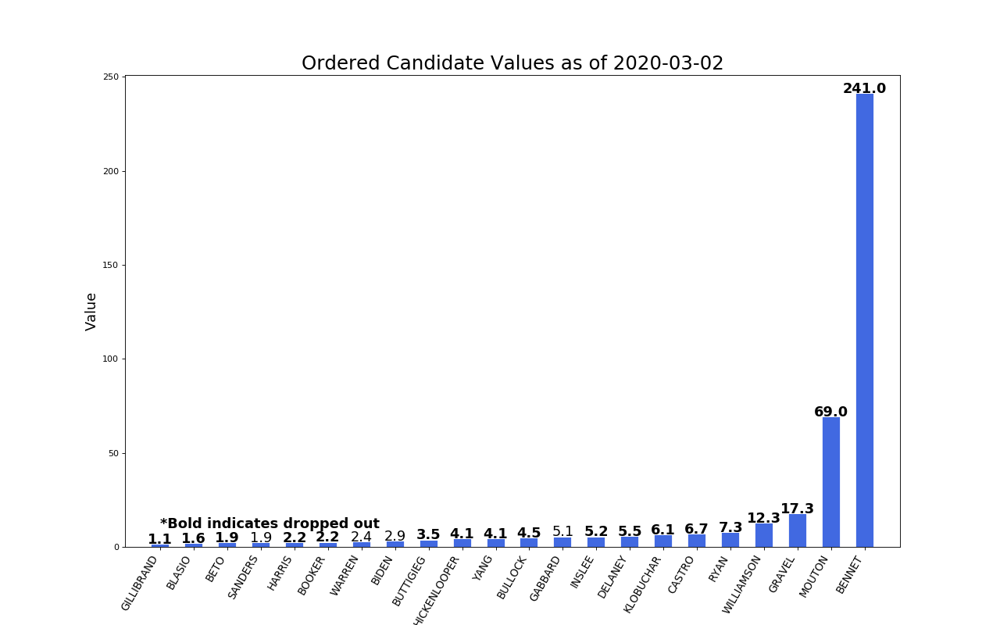
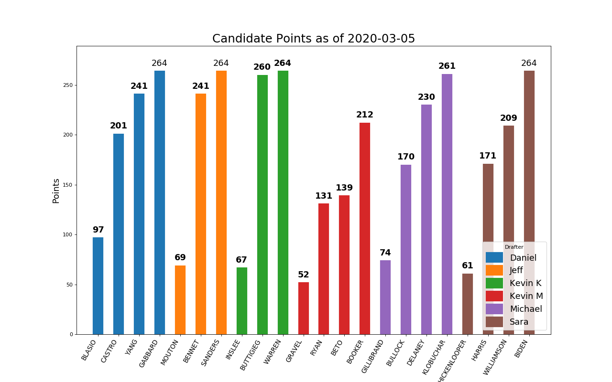
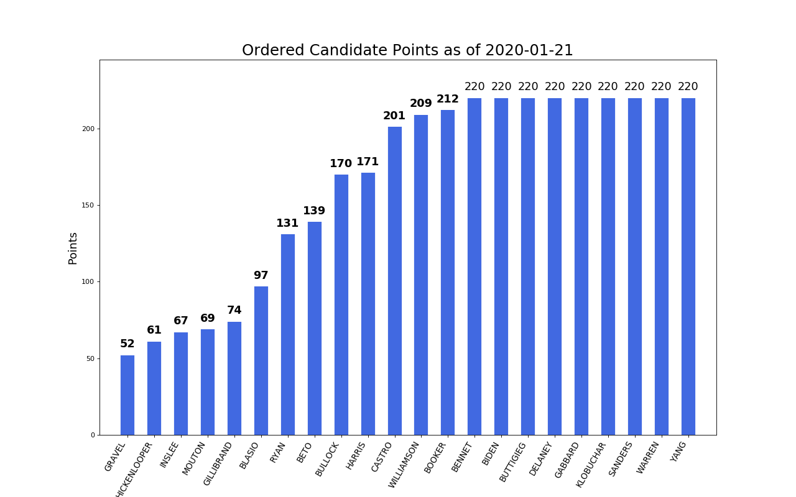

# The 2020 Demmy Awards
For the past few years, my friends and I have taken to creating "fantasy" political drafts. The most recent was a draft of the 2020 democratic presidential candidates.

The original draft took place on June 15, 2019 and was an auction. Each drafter was alloted 200 "Democracy Bucks" that could be spent however one felt. The candidates were chosen in random order and bidding was done in a circular manner of which the order was determined randomly.

The results of the draft can be found in Roster.xlsx which is also where I track the drop date of the candidates.

Eventually, I would like to do some more analysis of who was the most cost effective with their points (i.e. most points per dollar spent) and other silly awards, hence the Demmy Awards.

For now, I'll update this periodically to check in on the plotting and have some fun.

# Draft Strategy

# Analysis
## Points to Date
The original idea for this project was to generate a plot of points accumulated as a function of time. I thought this would be interesting to see since it might give an indication of what would look like an early lead or a potential upset. Ultimately, I found this plot to be kinda boring and lackluster so I'm in the process of researching to see if there's another data vis method that could represent the data adequately but look better.

## Candidate Values
Candidate values were the first metric I thought to include as a way of measuring a drafters efficiency in use of their dollars. What can be seen here is that many of the people considered early "front runners" often have lower values because their bidding was typically more fierce and resulted in a higher end price. The candidates with the highest value tended to be ones that went for very low prices (e.g. Gravel for $3) and so they appear to have an inflated effect.

## Candidate Points
In the end, what wins the game is total candidate points, not any kind of efficiency or value. Here we see the individual candidates contributions grouped by drafter. A bolded score indicates that that candidate has dropped out and so cannot contribute any more points beyond what they are capped at.

## Sources:
1) Plot inspiration taken from [here](https://www.machinelearningplus.com/plots/top-50-matplotlib-visualizations-the-master-plots-python/#15.-Ordered-Bar-Chart)