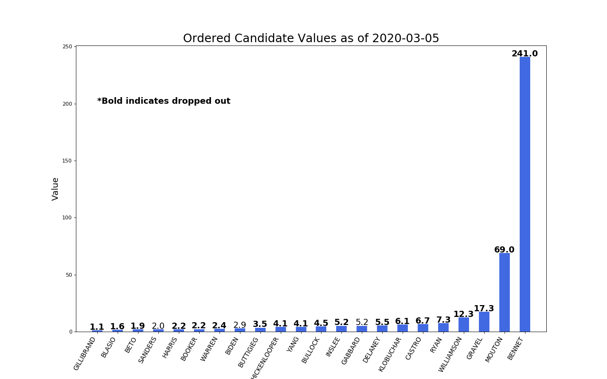
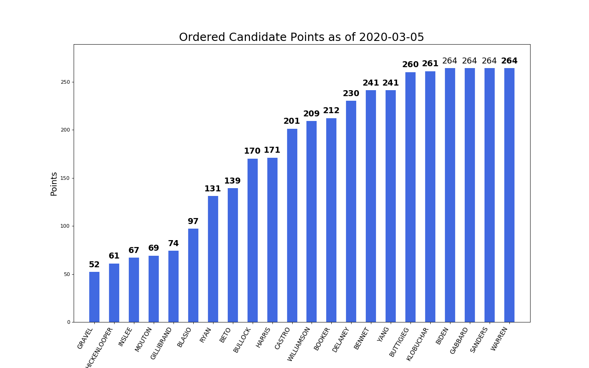

# The 2020 Demmy Awards
For the past few years, my friends and I have taken to creating "fantasy" political drafts. The most recent was a draft of the 2020 democratic presidential candidates.

The original draft took place on June 15, 2019 and was an auction. Each drafter was alloted 200 "Democracy Bucks" that could be spent however one felt. The candidates were chosen in random order and bidding was done in a circular manner of which the order was determined randomly.

The results of the draft can be found in Roster.xlsx which is also where I track the drop date of the candidates.

Eventually, I would like to do some more analysis of who was the most cost effective with their points (i.e. most points per dollar spent) and other silly awards, hence the Demmy Awards.

For now, I'll update this periodically to check in on the plotting and have some fun.

# Analysis
## Points to Date

## Candidate Values

## Candidate Points

## Sources:
1) Plot inspiration taken from [here](https://www.machinelearningplus.com/plots/top-50-matplotlib-visualizations-the-master-plots-python/#15.-Ordered-Bar-Chart)